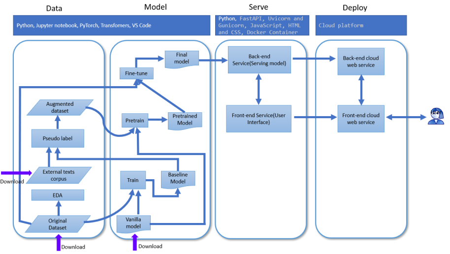

# 1-Objective

In this tutorial, I will present how to build a deep learning web application to evaluate the readability of text segments. This tutorial could be said as a project-based crash course for full stack deep learning engineering.

By the end of this tutorial, the following contents will be presented:

- Part1: [Objective](#1-objective)
- Part2: [Set up the development environment](#2-set-up-the-development-environment)
- Part3: [Exploratory data analysis](#3-exploratory-data-analysis)
- Part4: [Train a baseline deep learning model](#4-train-a-baseline-deep-learning-model)
- Part5: [Download and prepare the external texts datasets](#5-download-and-prepare-the-external-texts-datasets)
- Part6: [Generate an augmented dataset by pseudo labeling the external datasets with baseline model](#6-generate-augmented-dataset-by-pseudo-labeling-the-external-datasets)
- Part7: [Pretrain the model with augmented dataset and finetune the model with original dataset](#7-pretrain-and-finetune-the-model)
- Part8: [Build and deploy the backend web service](#8-build-and-deploy-the-backend-web-service)
- Part9: [Build and deploy the frontend service and connect it to the backend service](#9-build-and-deploy-the-frontend-service-and-connect-it-to-the-backend-service)

The whole pipeline of this project is shown in the below diagram.



The domain of full stack deep learning engineering is much broader than which are covered by this tutorial. If we are shipping a real-world production-level application, definitely we need to add more ingredients such as Version Controlling, Software Testing, CI/CD, System Monitoring, etc. In this tutorial, I intend to give a general picture of what's going on with full-stack deep learning engineering. Meanwhile, I would make it as much practical as I could, therefore the readers can gain hands-on skills. I hope it will be helpful for the reader's learning or working. 

Before we start, please take a look of the demo of my application on the cloud or visit [Emily's NLP Blog](https://emilynlp.github.io/Emily-NLP-Blog/). 


You can find all the code under the folder of "code" in [my GitHub repository](https://github.com/EmilyNLP/Full-Stack-Deep-Learning-NLP-Building-and-Deploying-a-Reading-Passages-Readability-Evaluator). 


- 1_notebooks: stores all the Jupyter notebooks for part2 to part7, and the requirement file for dependencies in the development environment.
- 2_data: includes the original training dataset, downloaded external datasets, processed external datasets, and augmented datasets. I only upload the original training dataset on GitHub. You are able to generate all the other data during running the code.
- 3_models: stores all the pretrained and finetuned models during the model training. I didn't upload the model files on the GitHub since they are large. You can  produce all the models if you run all the code successfully.
- 4_backend: folder for building backend service.
- 5_frontend: folder for building frontend service.

Let us start with development environment setup. 

# 2-Set up the development environment

I assume you have installed python 3.8 or a higher version on your computer. If not, I recommend you to install [Anaconda](https://docs.anaconda.com/anaconda/install/index.html). And if you are new to programming with python, it is better to construct the project folder in the same structure as my repository to avoid errors while running the code. If you are beyond a beginner, feel free to adjust it as you want.

Launch the Anaconda prompt, the "base" indicates the default environment Anaconda installed for you. Create a project folder named "readability-evaluator" or another name you prefer. 

```
(base) C:\>mkdir readability-evaluator
(base) C:\>cd readability-evaluator
(base) C:\readability-evaluator>
```
Copy or git clone all the contents from the fold "code" to the current directory, enter the subfolder 1_notebooks. Then create a new python environment named "readability" or whatever you like, and activate the new environment.

```
(base) C:\readability-evaluator>cd 1_notebooks
(base) C:\readability-evaluator\1_notebooks\>conda create --name readability python==3.8.0
(base) C:\readability-evaluator\1_notebooks\>conda activate readability
(readability) C:\readability-evaluator\1_notebooks>
```

Our deep learning model will be built with a leading deep learning framework [PyTorch](https://pytorch.org/) and NLP framework [Transfomers](https://huggingface.co/transformers/). I have compiled two requirements of dependencies files to go with GPU or CPU computation needs respectively.  

- If you only want to use CPU for computation, simply use the pip tool to install packages specified by "requirements_dev.txt".

```
(readability) C:\readability-evaluator\1_notebooks>pip install -r requirements.txt
```

- If you have GPU on your computer and desire to run the computation on them, I suggest you first go to [PyTorch](https://pytorch.org/), copy the command from the website, and run it on your computer(like the command in the blue frame below).  This step will allow you to install PyTorch and compatible supporting GPU libraries correctly. After that, use the pip tool to install other needed packages specified by "requirementsnotorch_dev.txt".


```
# replace the command with which you get from PyTorch webpage. 
(readability) C:\readability-evaluator\1_notebooks>conda install pytorch torchvision torchaudio cudatoolkit=10.2 -c pytorch 
(readability) C:\readability-evaluator\1_notebooks>pip install -r requirementsnotorch_dev.txt
```

We will use Jupyter Notebook to fulfill the task from part2 to part7. Jupyter Notebook comes with installing Anaconda. If you don't have experience of it, you can refer to [here](https://docs.anaconda.com/ae-notebooks/4.3.1/user-guide/basic-tasks/apps/jupyter/). All the notebooks for these tasks are under the folder "1_notebooks". Make sure you run them under the development environment we created just now, doing so will make you less likely to get the errors like "No module found".

We will use the training dataset from [CommonLit Readability Prize from Kaggle](https://www.kaggle.com/c/commonlitreadabilityprize/data) as the original training dataset, you can find the file under the "data" subfolder.

Ok, we are ready to do the EDA (Exploratory data analysis).

# 3-Exploratory data analysis

The code for EDA is in the notebook "1_EDA.ipynb". 

## 3.1 Import dependencies

```python
import numpy as np
import pandas as pd
import os
from pathlib import Path
from wordcloud import WordCloud,STOPWORDS
import matplotlib.pyplot as plt
%matplotlib inline
import seaborn as sns
sns.set_style("dark")
import matplotlib.pylab as pylab
params = {'legend.fontsize': 'large',
         'axes.labelsize': 'large',
         'axes.titlesize':'large',
         'xtick.labelsize':'large',
         'ytick.labelsize':'large'}
pylab.rcParams.update(params)
```

## 3.2 Constant

The original training dataset is stored as the file of "train.csv" under the path of  "./data/training/original/". 

```python
ORIGINAL_TRAIN_PATH=os.path.join(Path(os.getcwd()).parent,'data','training','original','train.csv') # path for original training dataset file
```

## 3.3 Load the dataset

After running the code below, we can have an overview of the original dataset. There are 2834 rows/samples and six columns/features in the original dataset. 

```python
train_df = pd.read_csv(ORIGINAL_TRAIN_PATH) # load the data as the DataFrame
train_df.info() # print out the overview information of the data
train_df.sample() # print out one sample of the data
```


We care about the columns of "excerpt", "target" and "standard_err". let us take one sample and print these features out.

- excerpt - text to be predicted reading ease of
- target - reading ease(the target is greater, the excerpt is easier, and vice versa)
- standard_error - a measure of spread of scores among multiple raters for each excerpt

```python
print("One example of excerpt:\n",train_df.iloc[5]['excerpt'])
print("The target of above excerpt is: ", train_df.iloc[5]['target'])
print("The standard deviation of the target is: ",train_df.iloc[5]['standard_error'])
```


## 3.4 The distribution of the "target"

```python
min_target=train_df['target'].min() # the minimum value of the target
max_target=train_df['target'].max() # the maximum value of the target
print(f'The minimum of the target is {min_target}, the maximum of the target is {max_target}')
sns.histplot(train_df['target'],bins=12) # plot the histogram of the distribution of target
```


## 3.5 The distribution of the length of the excerpts (number of words in a excerpt)

```python
train_df['wordcount']=train_df['excerpt'].str.split().apply(len) # calculate the number of words(length) for each excerpt
count_mean=np.mean(train_df['wordcount']) # calculate the average of length 
count_std=np.std(train_df['wordcount']) # calculate the standard deviation of length
print(f"The average word count is {count_mean}, The std of the word count is {count_std}")
fig,ax=plt.subplots()
sns.histplot(train_df['wordcount'],bins=12) # plot the distribution of the length
ax.axvline(count_mean,color='purple')
ax.annotate('mean', xy=(173,150),xytext=(180, 150), font='Serif',arrowprops=dict(facecolor='black', shrink=0.05),) # annotate the average length in the diagram
plt.show()
```


## 3.6 Examine the distribution of length for difficult excerpts and easy excerpts separately

It looks like that there is no significant difference in length distribution between easy passages and difficult passages.

```python
# split the samples into difficult and easy categories. If target is greater than -1, sample goes to easy section, and target is less than -1, sample goes to hard section.
hard_df=train_df[train_df['target']<-1]
easy_df=train_df[train_df['target']>=-1]
fig,ax=plt.subplots(1,2, figsize=(10,5))
sns.histplot(data=hard_df['wordcount'],ax=ax[0])
ax[0].set_title("hard passages")
sns.histplot(data=easy_df['wordcount'], ax=ax[1])
ax[1].set_title('easy passages')
plt.show()
```


## 3.7 The relation between the target and the passage length

From the scatter plot, the relation between the target and the passage length is not significant.

```python
sns.scatterplot(x=train_df['wordcount'],y=train_df['target'])
plt.show()
```


## 3.8 The most frequent words in easy excerpts 

```python
wc=WordCloud(stopwords=STOPWORDS,max_words=150,background_color='white') # Initialize the WordCloud
wc.generate(' '.join(easy_df['excerpt'])) # Generate the WordCloud with the excerpts from easy passages
plt.imshow(wc) # plot the WordCloud
```


## 3.9 The most frequent words in difficult excerpts 

```python
wc=WordCloud(stopwords=STOPWORDS,max_words=150,background_color='white')
wc.generate(' '.join(hard_df['excerpt']))
plt.imshow(wc)
plt.show()
```


## 3.10 Summary of EDA 

After exploring the original dataset, we have gained general information about it, including the size and structure,  distribution of the target and excerpt length, frequent words used in the easy and hard excerpts, etc. However, the above analysis is far from building a reliable model to tell the complexity of the paragraphs. Thanks to the success of neural-network technologies in recent years, which can achieve remarkable performance in various tasks in computer vision and natural language processing. Next, we will utilize the cutting-edge NLP pre-trained deep learning model(Vanilla model) and the commmonlit dataset to build our baseline model to evaluate the readability of the text segments.  

# 4-Train a baseline deep learning model 

In this chapter, we will train a baseline deep learning model to evaluate the readability of text segments. The model we will utilize is [RoBERTa](https://huggingface.co/transformers/model_doc/roberta.html). RoBERTa is a popular variant of [BERT](https://huggingface.co/transformers/model_doc/bert.html) trained with much larger mini-batches and learning rates and without the next-sentence pre-training objective. You can learn more about RoBERTa from [here](https://arxiv.org/abs/1907.11692).  

The notebook in this chapter is 2_train_base_model.ipynb. Firstly, import the necessary libraries and define the constants and functions.

## 4.1 Import dependencies

```python
from transformers import AutoConfig, AutoTokenizer, AutoModelForSequenceClassification, AdamW, get_scheduler
import torch
from torch import nn
from torch.utils.data import DataLoader, RandomSampler, SequentialSampler,TensorDataset
import numpy as np
import pandas as pd
import os
from tqdm import tqdm
import random
import gc
from pathlib import Path
```

## 4.2 Constants and seed_everything function

From now on, all the Jupyter notebooks share the same constants and "seed_everything" function below. Please revisit this part for reference if you are confused with the constants in the subsequent chapters.

```python
#set a random seed for our pseudo-random number generator, ensures reproducibility
def seed_everything(seed):
    random.seed(seed)
    os.environ['PYTHONHASHSEED'] = str(seed)
    np.random.seed(seed)
    torch.manual_seed(seed)
    torch.cuda.manual_seed(seed)
    torch.backends.cudnn.deterministic = True

SEED = 2021 #
BINS = [float('inf'), 1.5, 1, 0.5, 0, -0.5, -1, -1.5, -2, -2.5, -3, -3.5, float('-inf')] # map the raw score to readability level from 1 to 12(easy to hard)
MAX_LENGTH = 256 # the maximum length of the sequence feed to the model
CORPORA_LIST = ['simplewiki','wiki','bookcorpus'] # the list of external datasets

TRAIN_FILE_ORIG=os.path.join(Path(os.getcwd()).parent,'data',"training","original","train.csv") #the file stores the original training dataset file
TRAIN_FILE_SPLIT=os.path.join(Path(os.getcwd()).parent,'data',"training","original","train_split.csv") # the file stores the split training dataset file
VAL_FILE_SPLIT=os.path.join(Path(os.getcwd()).parent,'data',"training","original","val_split.csv") # the file stores the split validation dataset file 
TRAIN_FILE_EXTENDED=os.path.join(Path(os.getcwd()).parent,'data','training','extended','train_augmented.csv') # the file stores the augmented training dataset file 

BASELINE_MODEL_DIR=os.path.join(Path(os.getcwd()).parent,"models","base") # the path stores trained baseline model 
PRETRAIN_MODEL_DIR=os.path.join(Path(os.getcwd()).parent,"models","pretrain") # the path stores model pretrained with augmented datasets  
FINETUNE_MODEL_DIR=os.path.join(Path(os.getcwd()).parent,"models","finetune") # the path stores model finetuned with split training dataset from the checkpoint of pretrained model  
FINAL_MODEL_DIR=os.path.join(Path(os.getcwd()).parent,"models","final") # the path stores model finetuned with the original training dataset from the check pint of pretrained model 

EMBEDDINGS_DIR=os.path.join(Path(os.getcwd()).parent,'data','embeddings') # the path stores embeddings of downloaded external datasets
EXTENDED_DATA_DIR=os.path.join(Path(os.getcwd()).parent,'data','training','extended') # the path stores downloaded external datasets
```

## 4.3 Split the original training dataset into train and validate dataset

Before training the model, we split the original dataset into train and validate dataset. This operation prepare us to train the model with the split train dataset and evaluate the performance of the model with split validate dataset. In order to let the the target in split train set and split validation set have similar distribution, first we define variable "BINS" which presents 12 interval or bins, next we map the numerical feature "target" to categorical feature "level " according to the bin in which the "target" falls in, then we use "StratifiedShuffleSplit" tool to split the original dataset into split train set and split validation set with the same distribution of "level".

```python
# map the raw score to readability level from 1 to 12(easy to hard)
BINS = [float('inf'), 1.5, 1, 0.5, 0, -0.5, -1, -1.5, -2, -2.5, -3, -3.5, float('-inf')] 
train_df_orig=pd.read_csv(TRAIN_FILE_ORIG)
train_df_orig['level']=train_df_orig['target'].apply(lambda x: np.digitize(x,BINS))
skf = StratifiedShuffleSplit(n_splits=1, test_size=0.1, random_state=67)
splits=skf.split(train_df_orig,train_df_orig.level)
for train_idx, test_idx in splits:
    train_df=train_df_orig.loc[train_idx]
    val_df=train_df_orig.loc[test_idx]
train_df.reset_index(inplace=True,drop=True)
val_df.reset_index(inplace=True,drop=True)
train_df.to_csv(TRAIN_FILE_SPLIT)
val_df.to_csv(VAL_FILE_SPLIT)
```

## 4.4 The main function for model training

```python
def train(model_name, training_file, out_dir, model_path=None, pretrain=False, val_file=None, num_epochs=3):
    #Initialize the model and tokenizer   
    tokenizer = AutoTokenizer.from_pretrained(model_name)
    config = AutoConfig.from_pretrained(model_name, num_labels=1)
    if model_path:
        model = AutoModelForSequenceClassification.from_pretrained(model_path, config=config)
    else:
        model = AutoModelForSequenceClassification.from_pretrained(model_name, config=config)
    #Load the training data, tokenize the text and covert into training dataloader
    training_df = pd.read_csv(training_file)
    training_embeddings=tokenizer(training_df['excerpt'].to_list(), padding=True, truncation=True, max_length=MAX_LENGTH, return_tensors='pt')
    training_dataset=TensorDataset(training_embeddings['input_ids'],training_embeddings['attention_mask'],torch.tensor(training_df['target'].astype('float32')))
    training_sampler = RandomSampler(training_dataset)
    training_dataloader = DataLoader(training_dataset,sampler=training_sampler,batch_size=8)
    #Load the validation data(if it is provided), tokenize it and convert into validation dataloader
    if val_file:
        val_df = pd.read_csv(val_file)
        val_embeddings=tokenizer(val_df['excerpt'].to_list(), padding=True, truncation=True, max_length=MAX_LENGTH, return_tensors='pt')
        val_dataset=TensorDataset(val_embeddings['input_ids'],val_embeddings['attention_mask'],torch.tensor(val_df['target'].astype('float32')))
        val_sampler = SequentialSampler(val_dataset)
        val_dataloader = DataLoader(val_dataset, sampler=val_sampler, batch_size=8)
    #Set up training optimizer and learning rate
    num_training_steps = num_epochs * len(training_dataloader)
    if pretrain: 
        lr=1e-6 # lower learning rate for pretraining
    else:
        lr=3e-5 # higher learning rate for finetuning
    optimizer = AdamW(model.parameters(), lr=lr)
    lr_scheduler = get_scheduler(
        "linear",
        optimizer=optimizer,
        num_warmup_steps=0,
        num_training_steps=num_training_steps
    )
    #if you have GPU on you computer, specify the device as""cuda", or else you can comment out next 2 lines
    device = torch.device("cuda")
    model.to(device)
    #training 
    for epoch in range(num_epochs):
        #Set the model into train mode, then torch could do the back-propagation over the loss to update the weights of model 
        model.train()
        print('epoch=',epoch+1)
        epoch_iterator = tqdm(training_dataloader, desc="Iteration")
        tr_loss=0
        for batch in epoch_iterator:
            batch = tuple(t.to(device) for t in batch)
            inputs = {
                    "input_ids": batch[0],
                    "attention_mask": batch[1],
                    "labels": batch[2],
                    }
            outputs = model(**inputs)
            loss = outputs.loss
            epoch_iterator.set_description('(loss=%g)' % loss)
            tr_loss+=loss.item()
            loss.backward() #compute gradient of loss over parameters
            optimizer.step() # update weights/parameters
            lr_scheduler.step() #update learning rate
            optimizer.zero_grad() # clear the gradient from this step
        tr_loss/=len(training_dataloader)
        print('tr_loss=',tr_loss)
        #If there is validation data, evaluate the model at each epoch
        if val_file:
            model.eval()
            val_loss=0
            for batch in val_dataloader:
                #only need evaluate the model(no mini-batch Stochastic Gradient Descent needed), set the torch with no_grad to speed up 
                with torch.no_grad():
                    batch = tuple(t.to(device) for t in batch)
                    inputs = {
                            "input_ids": batch[0],
                            "attention_mask": batch[1],
                                }
                    labels=batch[2]
                    outputs = model(**inputs).logits
                    loss_fct = torch.nn.MSELoss()
                    eval_loss = loss_fct(outputs.view(-1), labels.view(-1)).item()
                    val_loss+=eval_loss
            val_loss=val_loss/len(val_dataloader)
            print('eval_loss=',val_loss)
    #Save the model after finish the training
    model.save_pretrained(out_dir)
    #Clean the memory
    del model
    torch.cuda.empty_cache()
    gc.collect() 
```

The above function is the primary function to train the deep learning model. In the real world, you may replace it with several functions or classes for better compliance with software development standards. Here I put everything into this function for the convenience of explanation. This function undertakes quite a few tasks:

- Initialize the model and tokenizer   
  Thanks for [Hugging Face](https://huggingface.co/) offering excellent open-source NLP(Natural language Processing) framework "transformers". We will use the class "AutoModelForSequenceClassification" as our base model class. This class has a classifier head atop the basic model. In our case, we choose the basic model as "roberta-base". Our task is to predict the numerical readability score corresponding to the input excerpt, which means model's outcome should be numerical instead of the number of categories the input excerpt falls into. Therefore we set the model parameter of "num_labels" as "1" to tell the model to behave like this. The role of the "tokenizer" is to convert the raw text into a sequence of tokens the model is able to handle. One more thing, If the "model_path" is provided, the weights and bias of the model will be initialized from pretrained check point we saved before. If not, those will be initialized from vanilla model from Hugging Face model hub.

- Load the training data, tokenize the text and load them into the training dataloader   
  We load the training data from "train.csv" file, convert the text to the sequence of tokens with tokenizer, then use the "TensorDataset", "SequentialSampler" and "DataLoader" from PyTorch to prepare the data into the format which is suitable to be fed to the model during training. Some other parameters needed to be mentioned are:
  - max_length:we set max_length as 256, which means the text will be truncated or padded to fit to form the sequence with length 256. If you have a powerful computing unit, you can surely increase MAX_LENGTH to accommodate longer sequences. 
  - batch_size: if your GPU has enough memory, you may increase the batch_size to a reasonably higher value. I set the batch_size as 8 to suit my 8G memory GPU.

- Load the validation data(if it is provided), tokenize it and load them into validation dataloader   
  If you have a validation dataset, you can set the parameter of the "val_file", it will be processed in the same way as the training dataset.

- Set up training optimizer and learning rate   
  - The role of the "optimizer" is to apply the process of updating model parameters(weights and bias) to reduce model error in each training step. The Adam optimization algorithm is widely adopted in deep learning practice and works well empirically.   
  - Besides, we set up lr_scheduler to create a schedule with a learning rate that decreases linearly from the initial learning rate to 0. For pretraining, we set a lower learning rate. For finetuning, we set higher learning rate. In this chapter, we will finetune the vanilla model to obtain a baseline model. Therefore the learning rate is higher. Setting up a suitable learning rate or learning rate schedule is one of critical factors for training a reliable machine learning model. If you are new to this area, I strongly encourage you to do some relevant research.   

- Train the model by applying mini-batch gradient descent   
  - I include some notes alongside the code to help you to better understand the process of training step.The training process is fulfilled by steps of mini-batch gradient descent. In each step, we feed one batch of data into the model, get the outcome(prediction), calculate the loss between the ground truth target and the prediction with predefined loss function, then the Adam optimizer applies gradient descent and updates the model parameters to lower the loss.   
  - The class "AutoModelForSequenceClassification" uses the MSE loss(mean squared error) function as the loss function to match with our task for regression(not classification). We also use this function to evaluate the performance of our model over the validation dataset.   
  - If you want to train the model with the same dataset for more than one epoch, you can set the "epochs" greater than 1. In this case, I put the epochs as 3, which means the model will be trained three times with the same training dataset. In practice, I recommend you not to start with high epochs, since it is very likely to cause over-fitting over the training dataset and lower the model's generalization. It's good to experiment with it while watching the score of evaluation metrics.   
  - If you want to train the model on GPU, set the model's device as "cuda" as I do. If you don't use GPU, the default computing device is CPU. 

- After finish training   
  After the training is finished, save the model and clear the memory.

Let us run the train function. Firstly, a warning message might come out. No need to panic, that is because the parameters of classifier layer on the top of ROBERTa-base model is not provided by the Hugging Face model hub, these weights are supposed to be initialized at the beginning of the training and to be updated during training procedure. As the training goes on, The training loss (mean squared error) decreases after each epoch of training. 
 
```python
train(model_name="roberta-base",training_file=TRAIN_FILE_SPLIT, out_dir=BASELINE_MODEL_DIR, val_file=VAL_FILE_SPLIT, num_epochs=3)
```


## 4.5 Make a prediction

Let us make a prediction for a sample from the validation dataset with our saved baseline model. The predicted score is quite close to the golden target.

```python
#The function to predict a single sample
def predict(model_name, model_dir,excerpt):
    tokenizer = AutoTokenizer.from_pretrained(model_name)
    config = AutoConfig.from_pretrained(model_dir, num_labels=1)
    model = AutoModelForSequenceClassification.from_pretrained(model_dir, config=config)
    embeddings=tokenizer(excerpt, padding=True, truncation=True, max_length=MAX_LENGTH, return_tensors='pt')
    model.eval()
    inputs = {"input_ids": embeddings['input_ids'],"attention_mask": embeddings['attention_mask']}
    with torch.no_grad():
        outputs = model(**inputs).logits
        score=outputs.view(-1).item()
    return score

val_df=pd.read_csv(VAL_FILE_SPLIT)
sample_excerpt=val_df.iloc[[16]]
text=sample_excerpt['excerpt'].to_list()[0]
prediction=predict('roberta-base',BASELINE_MODEL_DIR,text)
print(text,"\n")
print(f"the prediction is {prediction}, the ground truth target is {sample_excerpt['target'].to_list()[0]}")
```


Now we have a baseline model on hand. Next, we will download some other texts datasets and use the baseline model to pseudo label these texts to generate an augmented dataset. I referred to [this solution](https://www.kaggle.com/c/commonlitreadabilityprize/discussion/257844) and made some adjustments for our needs.

# 5-Download and prepare the external texts datasets 

As we know, there are only 2834 samples in the original Commonlit dataset. In practice, it is not big enough to make our deep learning model reliable and generalized. We need to augment the training dataset to boost the model performance. In this chapter,  We will download three extra texts datasets which are [Wiki text](https://huggingface.co/datasets/wikitext), [SimpleWiki](https://public.ukp.informatik.tu-darmstadt.de/reimers/sentence-transformers/datasets/simplewiki-2020-11-01.jsonl.gz) and [Book corpus](https://huggingface.co/datasets/bookcorpus) and make text snippets with similar lengths to the original Commonlit dataset. The code in this chapter is in 3_external_data_prepare.ipynb.


## 5.1 Functions

The function "encode_and_save" encodes the texts into embeddings. Here, I introduce the ["paraphrase-TinyBERT-L6-v2" model from Sentence-Transfomer](https://huggingface.co/sentence-transformers/paraphrase-TinyBERT-L6-v2) to encode the texts into embeddings. This model maps a paragraph to a 768-dimensional dense vector space and can be used for tasks like sentence similarity search, clustering, or semantic search. We will use embedding as the input of the sentence similarity search in the following chapter.

```python
def encode_and_save(sentences, out_dir, data_name, model_name='paraphrase-TinyBERT-L6-v2'):
  model = SentenceTransformer(model_name)
  encoded = model.encode(sentences, convert_to_tensor=True)
  encoded=encoded.detach().cpu()
  if not os.path.isdir(out_dir): 
    os.makedirs(out_dir)  
  out_file = os.path.join(out_dir, 'encoded-' + data_name + '.pt')
  with open(out_file, 'wb') as f:
    torch.save(encoded, f)
  print("The embeddings are saved.")
  del model
  torch.cuda.empty_cache()
```

The function "chunktext" chops the long text into chunks, the size of each chunk is a random number between the average length minus four standard deviations of length and the average length plus four standard deviations of length. (The average length is 173, and std is 17, as we calculated during EDA. Therefore, the chunk size is in the interval of [173-, 173+4*17]).

```python
def chunktext(s):
    chunksize=int(truncnorm( -4, 4, loc=173, scale=17).rvs()) # gengerate the size of chunk
    words=s.split()
    chunks=[]
    for i in range(len(words)//chunksize+1):
         ch=" ".join(words[i*chunksize:i*chunksize+chunksize])
         chunks.append(ch)
    return chunks
```

## 5.2 Download and prepare the Wiki texts

The process of downloading is supposed to be smooth. After downloading, we filter out too short or too long paragraphs and encode them into embeddings, then save the paragraphs to a csv file and save the embeddings in the format of Pytorch tensor for use in the next chapter. 

```python
#Download the dataset and perform filtrating, cleaning and formating
wikitext_dataset = load_dataset('wikitext', 'wikitext-103-v1')
wikitext_train = wikitext_dataset['train']
wikitext_train=[text for text in wikitext_train['text'] if len(text.split())>100 and len(text.split())<200]
wikitext_train=[text.replace('\n',' ') for text in wikitext_train]
#Save the processed texts as csv file
wikitext_train_df=pd.DataFrame(wikitext_train,columns=['text'])
wikitext_train_df.to_csv(os.path.join(EXTENDED_DATA_DIR,'wiki.csv'))
#Encode the texts into embeddings and save them
encode_and_save(wikitext_train, EMBEDDINGS_DIR, 'wiki')
gc.collect()
```

## 5.3 Download and prepare the SimpleWiki texts

The whole processing is similar to wiki texts.

```python
simplewiki_savepath=os.path.join(Path(os.getcwd()).parent,"data","download")
if not os.path.isdir(simplewiki_savepath):
    os.makedirs(simplewiki_savepath)
simplewiki_file=simplewiki_savepath+'/simplewiki-2020-11-01.jsonl.gz'
#download the SimpleWiki data and unzip it
urllib.request.urlretrieve('https://public.ukp.informatik.tu-darmstadt.de/reimers/sentence-transformers/datasets/simplewiki-2020-11-01.jsonl.gz',simplewiki_file)
passages = []
with gzip.open(simplewiki_file, 'rt', encoding='utf8') as f:
    for line in f:
        data = json.loads(line.strip())
        passages.extend(data['paragraphs'])
#filter out snippets which are too short or too long 
passages = [p for p in passages if len(p.split()) < 200 and len(p.split())>100]
simplewiki_df=pd.DataFrame(passages,columns=['text'])
#save the processed texts as csv file
simplewiki_df.to_csv(os.path.join(EXTENDED_DATA_DIR,'simplewiki.csv'))
#Encode the texts into embeddings and save them
encode_and_save(passages, EMBEDDINGS_DIR, 'simplewiki')
gc.collect()
```

## 5.4 Download and prepare book corpus

The book corpus texts dataset is enormous. Hence I only extract 10% of the entire dataset as our external dataset. If you have enough storage space, feel free to increase the data volume. 

```python
#Load the dataset
books = load_dataset('bookcorpusopen')
books = books['train'].remove_columns('title')
books=pd.DataFrame(books['text'],columns=['text'])
bookcorpus_df=books.sample(frac=0.1).reset_index()
bookcorpus_df.drop(columns=['index'],inplace=True)
# split each book into chunks
bookcorpus_df['text']=bookcorpus_df['text'].map(chunktext) 
bookcorpus_df=bookcorpus_df.explode('text').reset_index()  
bookcorpus_df=bookcorpus_df[['text']]
#save the processed texts as csv file
bookcorpus_df.to_csv(os.path.join(EXTENDED_DATA_DIR,'bookcorpus.csv'))
#Encode the text to embeddings and save them
encode_and_save(bookcorpus_df['text'], EMBEDDINGS_DIR, 'bookcorpus')
```

## 5.5 Take a look at the external texts and corresponding embedding

There is nothing complex for downloading the texts and processing them into roughly the same length of as the original dataset. Let us look at the sample of the dataset and its corresponding embedding. 

```python
simplewiki_df=pd.read_csv(os.path.join(EXTENDED_DATA_DIR,'simplewiki.csv'))
simplewiki_df['text'][5]
```
'Lion dances were probably newer. China has not had its own lions since the spread of people out of Africa into the rest of the world. The earliest lions in Chinese books were gifts to the Han emperor from Parthia and other people who lived along the Silk Road connecting Chinese and Roman businesses. There was lion dancing under the Tang and in Japan by the 8th century, but people still thought of it as a foreign dance used by Buddhists. Today, people talk about "Northern" and "Southern" kinds of lion dances. The special northern kind began under the Southern Song (12th–13th century). The special southern kind began in Guangdong later, maybe under the Ming (14th–17th century).'

```python
#The tensor corresponding to the embeddings of text above
embedding=torch.load(os.path.join(EMBEDDINGS_DIR,"encoded-simplewiki.pt"))[5]
print("the demension of embedding is",embedding.shape)
```
the dimension of embedding is torch.Size([768])

Next chapter, we will generate augmented dataset by pseudo labeling these processed external texts. 


# 6-Generate augmented dataset by pseudo labeling the external datasets

The whole process to generate an extended training dataset is shown in below diagram.


- note1: For each paragraph in original dataset, find the top k similar texts in the external dataset. The similarity between two paragraphs is measured by the cosine-similarity of the corresponding embeddings. 

- note2: Feed the external paragraphs into the baseline model, the model gives out the predicted targets. We call these targets pseudo labels. 

- note3: For each sample in the original training dataset, there is a feature of "standard_error". This feature refers to the measure of the spread of scores among multiple raters for each excerpt. In order to make the extended dataset closer to the original dataset, we should rule out texts with pseudo labels out of the range of the standard_error centered with the target of its similar original text. For example, we have a original sample with target as two and standard_error as 0.5. We expected all of its similar paragraphs have pseudo labels in the range of [1.5,2.5]. If a similar external paragraph has pseudo label 2.7, we would not add it to the augmented dataset. 

## 6.1 Utility functions

This function "search_similar_passages" return top_k similar external paragraphs for each original paragraph.

```python
def search_similar_passages(original_texts, external_texts_list, top_k):
  model = SentenceTransformer('paraphrase-TinyBERT-L6-v2')
  external_embeddings = [] # all the embeddings corresponding to excerpts in external datasets
  sentences = [] # all the excerpts in external datasets
  for dataset in external_texts_list:
    embeddings_dir = os.path.join(EMBEDDINGS_DIR, 'encoded-'+ dataset + '.pt')
    if os.path.isfile(embeddings_dir):
      encoded = torch.load(embeddings_dir)
      external_embeddings.extend(encoded)
    else:
      raise FileNotFoundError(f'{dataset} embeddings could not be found.')
    texts_dir = os.path.join(EXTENDED_DATA_DIR,dataset+'.csv')
    if os.path.isfile(texts_dir):
      sents = pd.read_csv(texts_dir)
      sents = sents.text.values
      sentences.extend(sents)
    else:
      raise FileNotFoundError(f'{dataset} texts could not be found.')
    assert len(external_embeddings) == len(sentences) # the length of both should be equal 
  original_embeddings = model.encode(original_texts, convert_to_tensor=True)#embeddings for original dataset 
  #for each original embedding, find a list of top_k entries(each entry is a pair of corpus_id(index in external_embeddings in our case) and similar score) sorted in descending similarity score.We call one list of this kind is a hit. If there are B original-embeddings, then the "hits" below consists of B hits. Totally, B*top_K entries will be returned after the function "util.semantic_search" is executed.
  hits = util.semantic_search(original_embeddings, external_embeddings, top_k=top_k, corpus_chunk_size=80000)
  selected = [] #length of selected is the number of original-embeddings, each element of it is a list of excerpts with size top_K 
  #retrive the passages from the list of 'sentences' based on the corpus_id from hits
  for hit in hits:
    sents = [sentences[h['corpus_id']] for h in hit]
    selected.append(sents)
  return selected
  ```

The function "zip_hits_scores" zips the sentence, score(outcome of baseline model), and standard deviation(from original dataset) together as one entry.

```python
def zip_hits_scores(hits, scores, stdev):
  zipped = []
  for idx, hit in enumerate(hits):
    current = [(h, scores[idx], stdev[idx]) for h in hit]
    zipped.extend(current)
  return zipped
```

The function "filter_on_stdev" filters out texts with pseudo labels out of range of one std centered with its corresponding original text's ground truth target as described in note3.

```python 
def filter_on_stdev(sentences, predictions, targets, stdev):
  pred_filtered = []
  sents_filtered = []
  for idx, pred in enumerate(predictions):
    if abs(pred-targets[idx]) < stdev[idx]:
      pred_filtered.append(pred)
      sents_filtered.append(sentences[idx])  
  return sents_filtered, pred_filtered
```

This function "chunks" put the samples into batches with input chunk size

```python
def chunks(lst, chunksize):
    """Yield successive n-sized chunks from lst."""
    for i in range(0, len(lst), chunksize):
        yield lst[i:i + chunksize]
```

The function "predict" takes a list of paragraphs and returns the list of the predicted targets as pseudo label.

```python 
def predict(model_name_or_dir, data):
  device = "cuda:0"
  config = AutoConfig.from_pretrained(model_name_or_dir, num_labels=1)
  tokenizer=AutoTokenizer.from_pretrained(config._name_or_path)
  model = AutoModelForSequenceClassification.from_pretrained(model_name_or_dir, config=config)
  model.to(device)
  model.eval()
  y_pred = []
  batches = chunks(data, 32)
  for batch in tqdm(batches):
    inputs = tokenizer(batch, return_tensors="pt", padding=True, truncation=True, max_length=MAX_LENGTH)
    input_ids = inputs['input_ids'].to(device)
    attention = inputs['attention_mask'].to(device)
    inputs = {
        'input_ids': input_ids,
        'attention_mask': attention
    }
    with torch.no_grad():        
          outputs = model(**inputs)
    logits = outputs[0].detach().cpu().numpy().squeeze().tolist()    
    y_pred.extend(logits)
  del model
  return y_pred
```

"generate_augmented_dataset" is the main function to generate an augmented dataset by assembling all the processes described as the diagram at the beginning of this chapter. The final extended dataset is saved as a csv file. Each sample in this dataset has features of "excerpt"(text)  and "target"(pseudo labels). 

```python
def generate_augmented_dataset(original_dir, external_dataset_list, model_dir, out_dir, top_k=10):
  torch.cuda.empty_cache()
  print("Load original dataset")
  original_train_df = pd.read_csv(original_dir)
  queries = [str(t) for t in original_train_df.excerpt.values]
  scores = [float(t) for t in original_train_df.target.values]
  stdev = [float(t) for t in original_train_df.standard_error.values]
  print('Start to search similar passages')
  #for each passage in the original corpus, select top_k similar passages in the external corpus
  hits = search_similar_passages(queries, external_dataset_list, top_k)
  zipped = zip_hits_scores(hits, scores, stdev)
  sentences = [t[0] for t in zipped]
  scores = [t[1] for t in zipped]
  stdev = [t[2] for t in zipped]
  torch.cuda.empty_cache()
  print('Predict target of the selected passages')
  predictions = predict(model_dir, sentences)
  print('Remove passages which predicted target is outside of the stdev(sandard deviation)')
  sents_filtered, preds_filtered = filter_on_stdev(sentences, predictions, scores, stdev)
  augmented_df = pd.DataFrame.from_dict({'excerpt': sents_filtered, 'target': preds_filtered})
  augmented_df.to_csv(out_dir)
  print(f'Selected passages are saved')
  torch.cuda.empty_cache()
```

Let us run the function "generate_augmented_dataset" to generate the external dataset:

```python
generate_augmented_dataset(TRAIN_FILE_ORIG, CORPORA_LIST,BASELINE_MODEL_DIR, TRAIN_FILE_EXTENDED)
```


## 6.2 Take a look at the augmented dataset

We load the saved augmented dataset and print the overall information out. It turns out that we have obtained extra 10097 training samples in hand. It is 5 times the size of the original dataset. That is great! We are ready to experiment with these extra data. We plan to pretrain the vanilla model with the external training dataset, then finetune the pretrained model with original training dataset. After that, we will see if the procedure of pretraining with the external dataset will improve the performance or not.

```python
augmented_df=pd.read_csv(TRAIN_FILE_EXTENDED)
augmented_df.info()
```


# 7-pretrain and finetune the model

The pipeline to finalize our model is as shown below


First, we pretrain the vanilla model with our augmented dataset using a lower learning rate. Meanwhile, we will evaluate the MSE of the pretrained model over the split training dataset. After finishing the pretraining, the model will be saved for finetuning. After one epoch of pretraining, the evaluation loss(MSE over the split training dataset) is around 0.60. We use the same "train" function in this chapter as in baseline model training, only input different parameters according to different tasks. 

```python
seed_everything(SEED)
train(model_name="roberta-base",training_file=TRAIN_FILE_EXTENDED, out_dir=PRETRAIN_MODEL_DIR, pretrain=True, val_file=TRAIN_FILE_SPLIT, num_epochs=1)
```


Next, we finetune the model with the original split training dataset from the saved checkpoint. In the meantime, we evaluate the model performance with the split validation dataset. After the finetuning is done, the evaluation loss(MSE over the split validation dataset) is around 0.44. This value is close to the top score from Kaggle commonlit readability competition. We better not finetune it more since it might lead to overfitting. 

```python
seed_everything(SEED)
train(model_name="roberta-base",training_file=TRAIN_FILE_SPLIT, out_dir=FINETUNE_MODEL_DIR, model_path=PRETRAIN_MODEL_DIR,val_file=VAL_FILE_SPLIT, num_epochs=1)
```


We make a prediction with the current model for the same data sample as which we did with the baseline model. The ground truth score is -2.045, the score from the baseline model is -1.42, and the score from the current model is -1.51. For this example, we could say the pretraining with the extended dataset improves the performance even the overall MSE over split validation dataset of the current model is higher than the loss from the baseline model. In the real world, apart from automatically augmenting the dataset, human labeling is an effective but expensive method to expand the dataset. In general, more data means more reliable model. We leave this topic here and move forward. 

```python
val_df=pd.read_csv(VAL_FILE_SPLIT)
sample_excerpt=val_df.iloc[[16]]
text=sample_excerpt['excerpt'].to_list()[0]
prediction=predict('roberta-base',FINETUNE_MODEL_DIR,text)
print(text,"\n")
print(f"the prediction is {prediction}, the ground truth target is {sample_excerpt['target'].to_list()[0]}")   
```


In order to make full use of the original dataset, we finetune the model with the whole original training dataset from the check point after pretraining to finalize the model parameters.

```python
train(model_name="roberta-base",training_file=TRAIN_FILE_ORIG, out_dir=FINAL_MODEL_DIR, model_path=PRETRAIN_MODEL_DIR, num_epochs=1)
```


Let us check some examples of inference with the final model.

```python
text="Every person in this family must read at least 30 minutes daily."
prediction=predict('roberta-base',FINAL_MODEL_DIR,text)
print(f"the readability score is {prediction}, the difficulty level is {np.digitize(prediction,BINS)} out of 1 to 12" )
```

the readability score is 0.31775805354118347, the difficulty level is 4 out of 1 to 12

```python
text="Dune is set in the distant future amidst a feudal interstellar society in which various noble houses control planetary fiefs. It tells the story of young Paul Atreides, whose family accepts the stewardship of the planet Arrakis. While the planet is an inhospitable and sparsely populated desert wasteland, it is the only source of melange, or 'spice', a drug that extends life and enhances mental abilities."
prediction=predict('roberta-base',FINAL_MODEL_DIR,text)
print(f"the readability score is {prediction}, the difficulty level is {np.digitize(prediction,BINS)} out of 1 to 12"  )
```

the readability score is -0.7596416473388672, the difficulty level is 6 out of 1 to 12

The outcome of the final model looks reasonable. We are good to build the application based on the final model.

# 8-Build and deploy the backend web service

## 8.1 Web application architecture

Starting from this chapter, we will utilize the final model to set up a actual web application. With this application, The user can input a paragraph, and then the application will return a readability level for this paragraph. At the production level, it is better to construct backend service and frontend service separately for a couple of reasons, including but not limited to scalability, Resource Optimization and easier upgradation.  The architecture and the data flow of the web application are illustrated in the diagram below. 


## 8.2 Set up backend service locally

All the code for backend service is in the folder "4_backend". In the production environment, we need other packages, including FastAPI, Unvicorn, Gunicorn, and we do not need some packages used in development environment. Hence, make sure to create a new environment for production. You can follow the same instruction to create the environment. The only change is to replace the "requirements_dev.txt" with "requirements_prod.txt". Besides, you need to install [docker](https://www.docker.com/products/docker-desktop) for later use. The structure inside the folder is as shown below. 


- folder "models"---- Stores the final model files for inference. I didn't upload my final model on the GitHub because it is huge. You can copy your final model to this folder and adjust the FINAL_MODEL_PATH constant accordingly in the model.py. 

- model.py----This python script includes the class of deep learning model we will use to predict the difficulty level of the paragraph. I will skip explaining it since we have already known about it during model training.

- fastapp.py----This python script provides the endpoint APIs built with [FastAPI](https://fastapi.tiangolo.com/). FastAPI has been drawing a lot of attention since it was released in 2018. It is fast, robust, compatible with open standards for APIs, and easy to use. The code for APIs is relatively straightforward. First, set up the model, then create application, define data class, define endpoint app.get with route "/ping" to test if the app can be accessed, define endpoint app.post with route "/predict" to receive a excerpt and return the readability information(excerpt, score, level) for this excerpt.  

```python
from fastapi import FastAPI
from pydantic import BaseModel
from fastapi.middleware.cors import CORSMiddleware
from model import Readabilitymodel,FINAL_MODEL_PATH

#create the model instance and load the trained model parameters for inference
model=Readabilitymodel(model_name='roberta-base',model_dir=FINAL_MODEL_PATH)

#Initialize an application
app = FastAPI()

#Specify the CORSMiddleware to allow a frontend running in a browser has JavaScript code that communicates with a backend, and the backend is in a different "origin" than the frontend. 
app.add_middleware(
    CORSMiddleware,
    allow_origins=["*"],
    allow_methods=["*"],
    allow_headers=["*"],
)

#data structure for input(sending from the frontend)
class InputExcerpt(BaseModel):
    excerpt:str

#data structure for result to send back to frontend
class Result(InputExcerpt):
    score:float
    level:int

#Route "/ping" for testing if the app has been set up succesfully
@app.get("/ping")
async def ping():
    # return our data
    return {'ping': "I got you!"}

#Route "/predict" for parsing the input data, making prediction, returning the result
@app.post("/predict",response_model=Result,status_code=200)
async def get_prediction(item: InputExcerpt):
    excerpt=item.excerpt
    score,level=model.predict(excerpt)
    response_object = {"excerpt":excerpt,"score": score, "level": level}
    return response_object
```

With these two python scripts and the final model, we are good to start a web service locally to predict the readability of paragraphs. Make sure you run the command under the production environment. Since FastAPI does not have web server, we use Uvicorn to start a web server, and specify the host IP address as local and listen on the port of 8008. The "--reload" means if the fastapp.py script was changed, then restart the server. 

```
(readability_prod)\C:\readability\4_backend>uvicorn fastapp:app --reload --workers 1 --host 0.0.0.0 --port 8008
←[32mINFO←[0m:     Will watch for changes in these directories: ['C:\\readability\\backend']
←[32mINFO←[0m:     Uvicorn running on ←[1mhttp://0.0.0.0:8008←[0m (Press CTRL+C to quit)
←[32mINFO←[0m:     Started reloader process [←[36m←[1m8672←[0m] using ←[36m←[1mstatreload←[0m
INFO:     Started server process [1300]
INFO:     Waiting for application startup.
INFO:     Application startup complete.
```
Navigate to http://localhost:8008/ping. the following information is expected to show:
```
{
  "ping": "I got you!"
}
```
We can test the predict API with tools like [Postman](https://www.postman.com/). For example, I send a poem of Shakespear's to the sever, it returns the original excerpt, score, and level. The level is 9 which is relatively complex (1 to 12 is easy to hard).


## 8.3 Deploy the backend service with Docker Container

We will build a Docker Image to pack everything we need to run the backend service together, then start a container application based on this Docker Image. I assume you have installed Docker on your computer successfully. 

- Dockerfile----This file provides instructions for how to build the Docker Image. We build our image on the top of the base image of python:3.8.0, then create the working directory, install dependencies needed in production. The last row is the command to start the service. The last row is slightly different from the command we used just now to start the server. Here, We add "gunicorn" to allow running multiple processes. In this case, we start 3 processes. Each process is a Uvicorn work class.  

```
#The base image 
FROM python:3.8.0
# Create the working directory
RUN set -ex && mkdir /app
WORKDIR /app
# Install Python dependencies
COPY . .
RUN pip install -r requirements_prod.txt
#the command to start the web service
CMD gunicorn -w 3 -k uvicorn.workers.UvicornWorker fastapp:app --bind 0.0.0.0:8008
```

Open an Anaconda prompt or CMD, enter the directory of 4_backend, run the following command to build Docker image. I name the image as "predictor", you can choose other names. Moreover, don't forget the "." at the end of command. It means using the Dockerfile in the local directory. Otherwise you should specify a Dockerfile.

```
(readability_prod)\C:\readability\4_backend\docker build -t predictor .
```
It will take a while to finish building the image. After it is done, we run a container application based on this built image. We name the container as predictor_local, expose the PORT 8008,  and publish the container's 8008 port to host's port 8008, "-d" means the container will run in the background.

```
(readability_prod)\C:\readability\4_backend\docker run --name predictor_local -e PORT=8008 -p 8008:8008 -d predictor
```
You should expect the same results as we start the backend service without docker container. If you want to stop running container, run the command below:
```
(readability_prod)\C:\readability\4_backend\docker stop predictor_local 
```
Now that we have built the container and run it smoothly locally, we are ready to deploy it on the google cloud platform.

## 8.4 Deploy the backend container on the Google Cloud Platform

After some research, I choose to deploy both the backend and frontend service on the [Cloud Run](https://cloud.google.com/run) for some reasons:

 - Flexibility: Deploy with your favorite language and framework/tools, and run as a container. This is the major reason why I choose Cloud Run to deploy both of my services.
 - Pay-per-use: By default, You only pay while a request is being handled.
 - Scalability: Automatically scales up or down from zero to 1000 instances depending on traffic.

I refer to [This Document from Cloud Run Official Guide](https://cloud.google.com/run/docs/tutorials/secure-services) and make some changes to meet the needs of my task. If you are not familiar with the interface of GCloud, I recommend you read this document. Doing so will help you prepare well for the following operations. 

Before starting, if you don't have an account for Google Cloud, you can [create your account](https://cloud.google.com/). 
  
 - In the Google Cloud Console, on the project selector page, select or create a Google Cloud project. I create a new project with ID "readability-334719".
 - Make sure that billing is enabled for your Cloud project
 - Enable the Cloud Run API for this project.
 - Install and initialize the Cloud SDK on your computer with CMD

Launch a command prompt, enter the "4_backend" folder, set the project and region 

```
# Set your default project ID
C:\readability\4_backend>gcloud config set readability-334719
#Configure gcloud for your chosen region
C:\readability\4_backend>gcloud config set run/region us-central1
#configure Docker to use the gcloud command-line tool to authenticate requests to Container Registry
C:\readability\4_backend>gcloud auth configure-docker
#build and push the image to gcloud container registry
C:\readability\4_backend>gcloud builds submit --tag gcr.io/readability-334719/predictor
#create a service account "predictor-identity" for backend_predictor
C:\readability\4_backend>gcloud iam service-accounts create predictor-identity
```

After running all the above commands, you can check your docker image at Container Registry on the gcloud console.


Go to the Cloud Run on the gcloud console, start to "create service", we will use the newly pushed docker image to start a container service.


Make sure to select the correct container port and choose more than 8 GB of memory since our deep learning model is memory-consuming.


Choose the service account we created as the compute identity for the backend service


At present, we intend to start a public service, which means we allow unauthenticated invocations. Shortly, we will adjust this setting and change it to a private service, only allowing authenticated frontend service to invoke the backend service.


Press the create button. If the deployment goes well, you will see the following information.


This page gives the URL of this application as "https://backend-predictor-kt457ggaca-uc.a.run.app". Let us test if the service works well. First, we test the "/ping" API with Chrome.


Then we test the "/predict" API with Postman. It looks like that the backend service on the gcloud runs well.


Next, we will build a frontend service to communicate with the backend service, and also it serves as the editor for users to input the paragraph.
  
  
# 9-Build and deploy the frontend service and connect it to the backend service

## 9.1 Deploy the frontend service locally

In this chapter we will build a frontend for user editing and communicating with the backend. All the code we need in this chapter is under the folder of "5_frontend". This application will be built with Node.js, HTML and CSS. I will not explain the details of the code as I did before since it is a generous-purpose frontend web system built on Node.js. If you have no experience with frontend development, I encourage you to do some research and gain new skills like me.

- "templates" folder----Including the index.html and images go with the html file.

- package.json----Specifies the dependencies.

- index.js---- The entry JavaScript. The server will listen on the port 8080.

- app.js---- The JavaScript defines two web APIs for frontend service. One is "get" method with path '/' for webpage loading. The other one is  "post" method with path "/predict" for communicating with the backend service, this API calls the function predictRequest in the predictor.js to fulfill the communicating.

- predictor.js---- The JavaScript defines the function communicating with the backend(sending the paragraph and receiving the returned prediction of readability). There are some commented codes for cloud deployment(service-to-service secure authentication). You can keep them commented currently and comment them out while deploying on the cloud. At this point, I specify the process.env.EDITOR_UPSTREAM_PREDICTOR_URL as the cloud backend URL we got from previous chapter. We do not need to specify it within the predictor.js while deploying on the cloud, but set it as a environment parameter during deployment.


```
process.env.EDITOR_UPSTREAM_PREDICTOR_URL="https://backend-predictor-kt457ggaca-uc.a.run.app";
```

To set up the service, firstly enter the 5_frontend folder and install Node.js packages with npm tool, "--only=production" means only installing dependencies for the production environment, not for the development environment. 

```
C:\readability\5_frontend\npm install --only=production
```
Then run the following command to start the service. Navigate to http://localhost:8080.

```
C:\readability\5_frontend\node index.js
```


I input the same Shakespeare's poem. It returns the level as 9.

In the same way as the backend service, we build a Docker Image for the frontend.

- Dockerfile---- Serve as the instructions to build the image for frontend Docker Image

```
# Use the official lightweight Node.js 10 image.
# https://hub.docker.com/_/node
FROM node:12-slim
# Create and change to the app directory.
WORKDIR /usr/src/app
# Copy application dependency manifests to the container image.
COPY package*.json ./
# Install only production dependencies.
RUN npm install --only=production
# Copy local code to the container image.
COPY . ./
# Run the web service on container startup.
CMD [ "node", "index.js" ]
```

Build and run the docker container. You will get the same result as running the command "node index.js".
```
C:\readability\5_frontend\docker build -t editor .
C:\readability\5_frontend\docker run --name editor_local -e PORT=8080 -p 8080:8080 -d editor
```

## 9.2 Deploy the frontend service on the gcloud

It is time to deploy the frontend service on the cloud and integrate with the backend service. However, before we do so, we need to make some changes to the predictor.js. 

 - Comment or delete this row in the predictor.js 

   ```javascript
   //process.env.EDITOR_UPSTREAM_PREDICTOR_URL="https://backend-predictor-kt457ggaca-uc.a.run.app";
   ```

 - Comment out this part of code in the predictor.js. We need it to generate the ID token and request authentication from target service. You can refer to [This Document from Cloud Run Official Guide](https://cloud.google.com/run/docs/tutorials/secure-services) for more details about the secure-services.

  ```javascript  
  try {
    // Create a Google Auth client with the Predictor service url as the target audience.
    if (!client) client = await auth.getIdTokenClient(serviceUrl);
    // Fetch the client request headers and add them to the service request headers.
    // The client request headers include an ID token that authenticates the request.
    const clientHeaders = await client.getRequestHeaders();
    serviceRequestOptions.headers['Authorization'] =
      clientHeaders['Authorization'];
  } catch (err) {
    throw Error('could not create an identity token: ', err);
  }
  ```
In most cases, you don't want your backend service open to the public. Instead, you want it be private and allow limited services to invoke the private backend service. The purpose of the code above is to use Cloud Run's built-in IAM-based service-to-service authentication feature to build a secure two services application. The dataflow across the frontend, backend and Cloud Run meta server is shown below.


We have already deployed the backend service on the cloud. Before we deploy the frontend service and connect it to the backend service, we need to change the backend's traffic setting from "allow unauthenticated invocations" to "Require authentication".


After this change, we cannot visit the backend service anymore.


We will deploy the frontend service on the cloud in the same way. Launch a command prompt, enter the "5_frontend" folder. Make sure your gcloud config has the correct project and region. You can revisit the code in the previous chapter if you don't know how to set them up. Then build and submit the frontend_editor docker image to the gcloud Container Registry.

```
#build and push the image to gcloud container registry
C:\readability\5_frontend>gcloud builds submit --tag gcr.io/readability/editor
#create a service account "editor-identity" as the compute identity for frontend service
C:\readability\5_frontend>gcloud iam service-accounts create editor-identity
```

You can check the editor docker image at Container Registry on the gcloud console.


Go to the cloud run on the gcloud console, start to "create service", we will use the pushed docker image editor to start a container service.


Make sure to select the correct container port.


Since we don't specify the "process.env.EDITOR_UPSTREAM_PREDICTOR_URL" in the predictor.js, we add the environment variable "EDITOR_UPSTREAM_PREDICTOR_URL", and set it as the URL of the backend service "https://backend-predictor-kt457ggaca-uc.a.run.app". 


Choose the service account "editor-identity" as the compute identity for the frontend service.


We allow unauthenticated invocations since the frontend service is designed to be a public service.


Press the create button. If the deployment goes well, you will see the following output.


This page gives the URL of the frontend application as "https://frontend-editor-kt457ggaca-uc.a.run.app/". The webpage can load successfully. However, the app fails to return the readability level.


The reason for the failure is that the backend service doesn't permit unauthenticated service to invoke it. To solve this problem, we add the editor-identity as cloud run invoker of the backend service. Navigate to the permission of the backend service and do so.


After the above change to the backend service, we test the frontend service again. Yeah, this time, the app runs well.


Since it is built on the Cloud Run without dedicated computation units(the point is to save the cloud cost), you might experience a cold-start if it has been a long time after your last visit to the application on the cloud. So please be patient to wait for a little while(1 or 2 minutes). After the service starts, it will run properly. Alternatively, you can choose to pay for the whole duration of the service running instead of pay-per-use to avoid cold-start.

## 9.3 Clean the cloud resource

After deploying, if you don't want to keep it running on the cloud, do not forget to clean the related cloud resource to avoid further billing. Of course, the simplest way is to shut down the whole project. 

# 10-What's next

So far, we have successfully built an end-to-end full-stack deep learning application. Even though it is not as sophisticated as the real word production, we have gone through most stages. Next, we can do more to make the application more advanced.

- Add test
- Set up database to make data flywheel working
- Add user administration
- Add system monitoring and logging
- Add CI/CD

# Reference

- [RoBERTa: A Robustly Optimized BERT Pretraining Approach](https://arxiv.org/abs/1907.11692)
- [Securing Cloud Run services tutorial](https://cloud.google.com/run/docs/tutorials/secure-services)
- [CommonLit Readability Prize 1st place solution](https://www.kaggle.com/c/commonlitreadabilityprize/discussion/257844)
- [SentenceTransformers Documentation](https://www.sbert.net/)
- [Transformers - Hugging Face](https://huggingface.co/docs/transformers/index)
- [FastAPI](https://fastapi.tiangolo.com/)
- [Docker: Empowering App Development for Developers](https://www.docker.com/)


